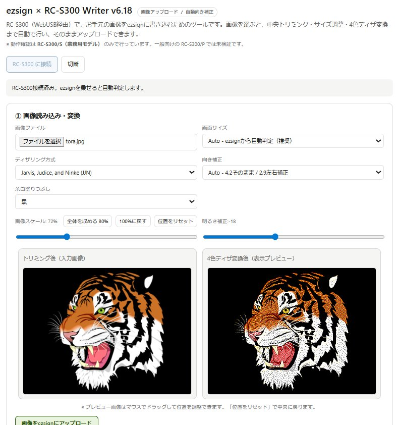
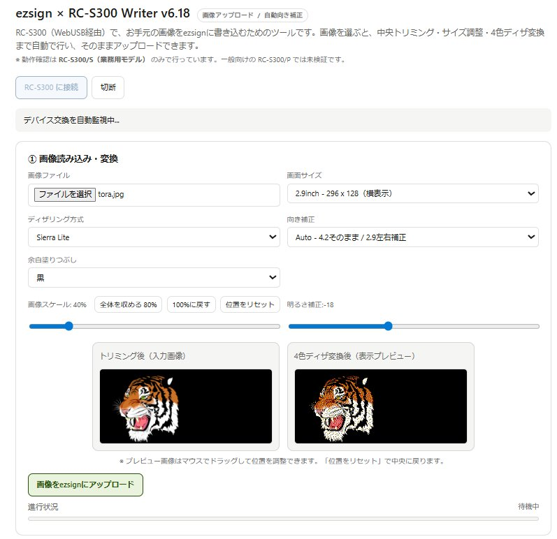

# EZ Sign NFC Tools

NFC で書き換え可能な 4 色電子ペーパー名札「EZ Sign」に、画像を書き込むためのツール集です。本リポジトリには、用途の異なる **2 つの実装** が同梱されています。

| 実装 | 形態 | リーダー | 主な用途 |
|---|---|---|---|
| [`ezsign-rcs300-writer.html`](./ezsign-rcs300-writer.html) | 単一ファイル HTML（WebUSB） | SONY RC-S300 | PC ブラウザから手軽に書き換え |
| [`ezsignNFC`](./src/ezsignNFC.h) Arduino ライブラリ | C++ ヘッダオンリーライブラリ | PN5180 | ESP32（M5AtomS3 等）に組み込んで自動化／キオスク端末化 |

両者は同じ EZ Sign 端末を対象としており、共通の APDU プロトコル仕様は [`extras/PROTOCOL.md`](./extras/PROTOCOL.md) にまとめています。

- HTML ツールの使い方を読みたい → 本ファイル続きの「Part 1: WebUSB HTML ツール」
- Arduino ライブラリの使い方を読みたい → 本ファイル続きの「Part 2: ezsignNFC Arduino ライブラリ」、詳細は [ezsignNFC_README.md](./ezsignNFC_README.md)

---

## Part 1: WebUSB HTML ツール (`ezsign-rcs300-writer.html`)

RC-S300（NFCリーダー／ライター）と WebUSB を使って、ブラウザから EZ Sign 電子ペーパー名札に画像を書き込むための単一ファイル HTML ツールです。インストール不要で、HTML を開けばそのまま使えます。

### スクリーンショット

4.2inch（400 × 300）に書き込む例。Jarvis, Judice, and Ninke でディザリングし、スケールと明るさを微調整した状態です。



2.9inch（296 × 128 の横長表示）に書き込む例。Sierra Lite で、スケールを下げて余白を黒で塗りつぶしています。



### 動作確認環境

- **リーダー：RC-S300/S（業務用モデル）でのみ動作確認しています。** 一般向けの RC-S300/P は未検証です。
- ブラウザ：WebUSB が利用できる Chromium 系（Google Chrome、Microsoft Edge など）
- 対象デバイス：EZ Sign 4.2inch（400 × 300）、EZ Sign 2.9inch（296 × 128）

動作確認済みの OS とブラウザの組み合わせは以下の通りです。

| OS | ブラウザ | バージョン |
|---|---|---|
| Windows 11 Pro | Google Chrome (Stable) | 148.0.7778.168 |
| Windows 11 Pro | Google Chrome (Beta) | 149.0.7827.14 |
| Windows 11 Pro | Google Chrome (Canary) | 150.0.7843.0 |
| macOS Tahoe 26.4.1 | Google Chrome (Stable) | 148.0.7778.168 |

上記以外の組み合わせ（Linux、Microsoft Edge、その他 Chromium 派生ブラウザなど）でも、WebUSB が有効であれば動作する可能性は高いですが、こちらでは未検証です。動いた／動かなかったという報告は Issue で歓迎します。

WebUSB の制限上、`https://` または `http://localhost`、もしくはローカルファイル（`file://`）として開く必要があります。iframe や sandbox 内では動作しません。

事前に、Sony 純正の NFC Port Software、FeliCa Secure Client、FeliCa Port 等の常駐ソフトを停止しておいてください。これらが RC-S300 を掴んでいると `claimInterface` に失敗します。

### できること

- ローカルの画像ファイル（JPEG / PNG / その他ブラウザが読める形式）を読み込んで、EZ Sign 用にサイズ調整・ディザリング変換
- 変換後の画像を EZ Sign にアップロードして表示を書き換え
- アップロード完了後、表示更新の完了をデバイスにポーリングで問い合わせ
- カードを抜き差ししたタイミングを自動検出して再判定（自動監視）

通常モード（既定）では、必要最小限の操作だけが見える状態になっています。デバッグモードに切り替えると、通信ログ・診断ボタン・各種詳細設定が表示されます。

### 使い方

1. ブラウザで `ezsign-rcs300-writer.html` を開きます。
2. RC-S300 を PC に接続し、EZ Sign 端末をリーダーの上に置きます。
3. 「RC-S300 に接続」ボタンを押し、表示されたデバイス選択ダイアログで RC-S300 を選びます。
4. EZ Sign を載せると、画面サイズ（4.2inch / 2.9inch）が自動判定されます。
5. 「画像ファイル」から書き込みたい画像を選びます。プレビューが表示されます。
6. 必要に応じてディザ方式・明るさ・スケール・余白色を調整します。プレビュー画像はマウスドラッグで位置調整も可能です。
7. 「画像をEZ Signにアップロード」を押すと書き込みが始まります。完了するとステータスが「成功」になります。

### 画像処理の流れ

選択された画像は、おおむね以下の順で処理されます。

1. **読み込みと向き判定** — 画像を Canvas に展開し、ターゲット画面の比率（4.2inch なら 4:3、2.9inch なら 296:128）と比較
2. **トリミング** — 長辺側を基準にスケーリングして中央を切り出し。スケール % と手動パン（ドラッグ）で位置・大きさを調整可能
3. **明るさ補正** — −80 〜 +80 の範囲で全体の明るさを加減
4. **ディザリング** — 選択したアルゴリズムで 4 色（黒 / 白 / 黄 / 赤）に減色
5. **向き補正** — 端末側で正しく表示されるよう、必要に応じて回転・左右反転を適用（既定では送信データ側のみ補正し、プレビューには反映しません）
6. **パッキング** — 2bit × 4 ピクセル単位で 1 バイトに詰める
7. **圧縮** — 純 JavaScript 実装の LZO 互換リテラル圧縮で送信サイズを削減
8. **フラグメント分割** — APDU の長さ制限に合わせてブロック分割し、ISO-DEP の I-Block チェイニングで送信
9. **表示更新コマンド送信** — 書き込み完了後にリフレッシュを指示
10. **完了確認** — 表示更新の完了ステータスをポーリングで取得

### 対応するディザリングアルゴリズム

| アルゴリズム | 特徴 |
|---|---|
| Floyd-Steinberg | 標準的。公式のアプリの初期値 |
| Atkinson | 輪郭がくっきりめでコントラスト強め。ロゴやイラスト向き |
| Jarvis, Judice, and Ninke (JJN) | 階調はなめらかだが、やや眠い印象になりやすい |
| Stucki | JJN と Floyd-Steinberg の中間 |
| Burkes | 軽量でクセが少ない |
| Sierra3 / Sierra2 / Sierra Lite | 安定して動作。Lite は処理が軽い |

既定は Sierra Lite です。

### モード切り替え

画面下部の「表示モード」セレクタで以下を切り替えできます。選択内容は `localStorage` に保存されます。

- **通常モード** — 必要な UI のみ表示
- **デバッグモード** — 通信ログ、診断ボタン、向き補正の手動設定、カラーチェック用テストパターン、リーダー情報取得など、開発・トラブルシュート向けの項目をすべて表示

### 既知の制限事項

- RC-S300/P での動作確認は行っていません
- WebUSB が無効なブラウザ（Firefox、Safari など）では利用できません
- 同じ RC-S300 を他のアプリ（NFC Port Software 等）が掴んでいると `claimInterface` に失敗します。その場合は他のアプリを終了してから再接続してください
- 画像の大きさやディザ後の情報量によっては、転送に複数フラグメントを要し、書き込みに数秒〜十数秒かかることがあります

---

## Part 2: ezsignNFC Arduino ライブラリ (`src/ezsignNFC.h`)

ESP32（M5AtomS3 など）+ PN5180 NFC リーダーから EZ Sign を書き換えるための、ヘッダオンリーの Arduino ライブラリです。HTML ツールと違って PC を介さないので、スタンドアロンの書き換え端末や、定期的に表示を切り替えるサイネージ用途に向いています。

### 主な機能

- ISO 14443-A の活性化、RATS (ISO 14443-4 昇格)、APDU 送受信
- 認証 / デバイス情報取得 / 画像送信 / 画面更新コマンド
- 自動 LZO 圧縮 + ISO 14443-4 I-Block チェイニングによる長い APDU の分割送信
- 画像 RGB 入力対応 (内蔵パレットで 4 色量子化)
- ノンブロッキング更新 + 自動 NFC 再接続 (画面更新中の接続切断対策)
- 4.2-inch 4-color の左右反転対応 (`flipH = true`)

### 最小コード例

```cpp
#include <M5Unified.h>
#include <ezsignNFC.h>

EzsignDevice ez;   // デフォルトピン (M5AtomS3)

void setup() {
  M5.begin();
  Serial.begin(115200);
  ez.setLogger([](const char* m) { Serial.println(m); });
  ez.begin();
}

void writeImage() {
  static uint8_t img[400 * 300];
  memset(img, COLOR_WHITE, sizeof(img));

  if (!ez.detect()) return;
  if (!ez.authenticate()) return;
  if (!ez.sendImageIndices(img, 400, 300, /*flipH=*/true)) return;
  if (!ez.refreshDisplay(/*blocking=*/false)) return;
  ez.waitForRefresh();
}
```

### サンプルスケッチ

`examples/` フォルダに以下の 3 つを同梱しています。

- `examples/HelloEzsign/` — 最小サンプル。ボタンを押すたびに 白 → 黒 → 黄 → 赤 と全画面ベタ塗りを切り替え
- `examples/SimpleImage/` — RGB 配列を渡して送信するサンプル（内蔵 4 色量子化）
- `examples/AutoSize/` — `getDeviceInfo()` で画面サイズを自動検出し、4.2inch / 2.9inch 両対応のテスト画像を生成

### 依存ライブラリ

- **M5Unified** — Arduino Library Manager から
- **PN5180-Library** (ATrappmann 製) — GitHub から手動取得：[https://github.com/ATrappmann/PN5180-Library](https://github.com/ATrappmann/PN5180-Library)
- **miniLZO 2.10** — 各スケッチフォルダに 4 ファイル (`minilzo.c`, `minilzo.h`, `lzoconf.h`, `lzodefs.h`) を手動配置：[https://github.com/yuhaoth/minilzo](https://github.com/yuhaoth/minilzo)

> 配線、Arduino IDE のセットアップ、API リファレンス、トラブルシューティングなどの詳細は [ezsignNFC_README.md](./ezsignNFC_README.md) を参照してください。

---

## 技術的な詳細（プロトコル仕様）

EZ Sign の APDU コマンド体系、画像データのパッキング規則、LZO 圧縮、RC-S300 を WebUSB から叩くための CCID 風ヘッダの組み立て方、ISO-DEP I-Block チェイニング、実機検証で判明した個別の制約事項などについては、[extras/PROTOCOL.md](./extras/PROTOCOL.md) にまとめています。実装の根拠や、別のハードウェア（PN5180、ESP32 / M5Stack など）に移植する場合の参考にしてください。

PROTOCOL.md には主に以下の内容が含まれます。

- 対応デバイスと通信方式（ISO 14443 Type-A、ISO 7816-4 APDU、AID）
- APDU コマンド（AUTH / GET INFO / IMAGE FRAGMENT / REFRESH / POLL STATUS）
- 画像データのピクセル並びとブロック分割の規則
- ISO-DEP I-Block チェイニング、PCB のビット構成、S(WTX) の扱い
- 実機で発見した制約（1 ブロック = 1 フラグメント制約、blockIndex の暗黙オフセット、`SW=6992` の意味など）
- RC-S300 + WebUSB 構成のためのフレームフォーマットとアクティベーション手順
- トラブルシュートチェックリスト

## ファイル構成

ビルド・依存パッケージは（HTML ツール側は）不要です。Arduino ライブラリ側の依存については上述の通り。

```
ezsign-rcs300-writer.html        WebUSB HTML ツール本体（Part 1）
ezsignNFC_README.md              Arduino ライブラリ用の詳細 README（Part 2）
README.md                        このファイル
LICENSE                          MIT License
library.properties               Arduino ライブラリのメタデータ
keywords.txt                     Arduino IDE 用シンタックスハイライト定義
src/
  └─ ezsignNFC.h                 Arduino ライブラリ本体（ヘッダオンリー）
examples/
  ├─ HelloEzsign/HelloEzsign.ino    最小サンプル（全画面ベタ塗り）
  ├─ SimpleImage/SimpleImage.ino    RGB 入力サンプル
  └─ AutoSize/AutoSize.ino          サイズ自動検出サンプル
extras/
  └─ PROTOCOL.md                 プロトコル仕様と実装メモ（両実装で共通）
docs/
  └─ images/                     README に貼っているスクリーンショット
```

## 参考にした情報・先行実装

このツールおよび PROTOCOL.md は、以下の先行調査・公開情報に大きく依拠しています。あらためて感謝します。

- [niw 氏のリバースエンジニアリング](https://gist.github.com/niw/3885b22d502bb1e145984d41568f202d) — EZ Sign の APDU 仕様の元になった調査
- [@alt-core 氏の nfc-eink](https://github.com/alt-core/nfc-eink) — Python 実装による追加調査と検証
- [sakura-system.com — WebUSB で FeliCa リーダーから読み取り](https://sakura-system.com/?p=3120) — RC-S300 の Vendor Specific プロトコルおよび WebUSB からの操作手順
- [laddge/esp32-pasori-rcs300](https://github.com/laddge/esp32-pasori-rcs300) — RC-S300 を USB Host で叩く実装
- [ATrappmann/PN5180-Library](https://github.com/ATrappmann/PN5180-Library) — Arduino から PN5180 を扱うベースライブラリ
- [yuhaoth/minilzo](https://github.com/yuhaoth/minilzo) — Arduino 側で使用している miniLZO 配布元
- [LZO (miniLZO)](http://www.oberhumer.com/opensource/lzo/) — LZO1X 圧縮アルゴリズム

特記事項：
- 本ツールおよび PROTOCOL.md は、すでに公開されている情報並びに、開発者個人が独自に調査・実装したものであり、EZ Sign の公式ツール／公式ドキュメントではありません。
- **利用は自己責任でお願いします。** 本ツールの使用によって EZ Sign 端末・PC・周辺機器に生じたいかなる不具合・損害についても、作者は責任を負いません。
- 本ツールおよびその内容に関して、株式会社サンテクノロジー（Santek）への問い合わせは行わないでください。同社はサポート対象外と明示されています。質問・不具合報告は本リポジトリの Issue にお願いします（ただし作者も個人の余暇で対応するため、すべてに返答できるとは限りません）。

## ライセンス

- `ezsign-rcs300-writer.html` および `ezsignNFC` ライブラリ本体: **MIT License**。詳細は [LICENSE](./LICENSE) を参照してください。
- Arduino ライブラリ側の依存ライブラリのライセンス:
  - `miniLZO`: GNU GPL v2 以上
  - `PN5180-Library`: LGPL v2.1 以上

  これらは本リポジトリには同梱しておらず、ユーザーが各配布元から別途取得する必要があります。
